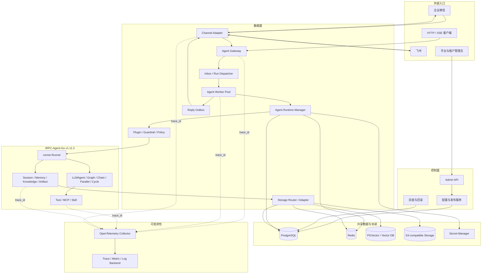

# 总体架构设计

> 本文描述参赛实现的目标架构和组件边界。它是 8 月 27 日方案文档的详细支撑材料，原始验收要求以仓库根目录 README 为准。

当前已实现网页和企微单聊文本入口：企微使用静态 Binding、专用串行 Consumer、共享 Session Run 及 PostgreSQL Inbox/Run/Outbox，并已完成[真实正常单聊](wecom-text-slice.md#真实单聊验证)。下文生产拓扑中的 Redis 唤醒、通用 Worker、Memory 和完整 OTel 不代表当前接线；IM 设计与实现映射见[收口记录](im-acceptance-closure.md)。

## 1. 设计结论

本项目采用“逻辑分层、渐进拆分”的方式：

- 逻辑上分为控制面和数据面，避免管理操作与高频 Agent 请求耦合。
- 当前使用一个 Go 进程提供网页与可选企微入口；同一二进制按角色启动属于后续部署设计。
- 生产阶段将 Gateway、Worker、Channel Adapter 和后台任务拆成独立 Deployment，分别扩缩容。
- Agent 以不可变 Revision 发布，在 Worker 中组装为 `agent.Agent + runner.Runner` 并按需缓存；灰度期间 Session 默认固定 Revision，避免同一对话行为漂移。
- 每次请求创建独立 Invocation；Session、Memory、配置、幂等和审计数据全部外置。
- Worker 不依赖 sticky session。任意健康 Worker 都能从共享后端恢复并继续一个已持久化会话。
- 平台扩展 tRPC-Agent-Go 的租户路由、运行协调和治理能力，不复制 Runner、Agent 或各类存储后端实现。

## 2. 系统架构图



图中的组件是职责边界，不代表第一版必须使用同等数量的进程。最小部署可以在一个进程内装配这些组件，并通过接口保留拆分能力。

## 3. 组件职责

| 组件 | 核心职责 | 不负责 |
| --- | --- | --- |
| Admin API | Tenant、Agent App、Revision、Channel Binding、Backend Profile、Policy 的管理接口 | 直接运行 Agent |
| 配置与发布服务 | 校验配置、生成不可变 Revision、切换流量、回滚 | 保存明文密钥 |
| Channel Adapter | 平台验签、消息解析、媒体下载、回复格式与平台限流适配 | 选择 Agent、执行 Prompt |
| Agent Gateway | 鉴权、租户解析、路由、限流、幂等入口、生成 `request_id` 和 `trace_id` | 持有会话内容、调用具体 Tool |
| Inbox / Dispatcher | 持久化待处理消息、重试、分配 Worker；未落库消息的补投取决于平台协议 | Agent 推理 |
| Agent Worker | 取得 Session 运行权、调用 Runner、消费 Event、处理超时取消 | 保存租户配置真相 |
| Runtime Manager | 加载 Revision，组装并缓存 Agent/Runner，管理引用计数和安全淘汰 | 保存用户 Session |
| Policy | 用户授权、工具白名单、预算、敏感信息、危险操作审批 | 实现具体业务 Tool |
| Storage Router | 按租户 Backend Profile 构造并缓存上游 Session/Memory/Knowledge/Artifact Service | 把所有数据强行放入同一种后端 |
| Reply Outbox | 持久化回复、记录投递结果；仅在平台允许时按 Channel 限流和重试 | 重新运行 Agent |
| Telemetry | 统一 Trace、Metric、Log、成本和审计关联字段 | 记录密钥和完整敏感正文 |

## 4. 控制面

### 4.1 Agent 发布模型

一个 Agent 使用两个层次表达：

- `Agent App`：稳定的业务身份，例如“订单客服”。Session 始终归属 App，不因版本升级改变。
- `Agent Revision`：不可变运行快照，包括模型、Prompt、Tool/MCP、Skill、Knowledge、Policy 和 Backend Profile 引用。

发布时先校验所有引用，再生成配置摘要 `config_digest`。Revision 一旦发布不可原地修改。灰度只修改 App 的路由规则，例如：

```text
revision-7: 90%
revision-8: 10%
```

路由结果在 Session 第一个 Run 开始时确定，写入 `sessions.pinned_revision_id`，每个 Run 同时记录实际 `revision_id`。同一 Session 默认持续使用该版本，直到会话 epoch 结束；新 Session 按最新路由规则选择。紧急安全回滚可以显式使指定 Revision 的 Session Pin 失效，正常回滚不修改历史 Run。

### 4.2 配置传播

PostgreSQL 是配置真相源。Worker 使用“通知 + 版本检查”更新本地缓存：

1. 发布服务提交新 Revision 和路由规则。
2. 发布配置变更通知；通知丢失不影响正确性。
3. Worker 收到通知后使对应缓存项失效。
4. 每次缓存命中仍比较路由版本或短 TTL，避免永久使用旧配置。

密钥字段只保存 `secret_ref`。Runtime Manager 在组装 Agent 时通过 Secret Resolver 读取，日志中只记录引用标识。

## 5. 数据面

### 5.1 统一入站消息

Channel Adapter 校验平台身份并完成 Binding/Principal 解析后，把不同平台消息转换为统一 `InboundEnvelope`。以下为持久输入的核心字段；完整契约及实验边界见 [Channel 输入契约](channel-pipeline.md#2-输入契约)，不是另一个同名 DTO：

```go
type InboundEnvelope struct {
    TenantID         string
    Channel          ChannelType
    ChannelBindingID string
    AgentAppID       string
    PrincipalID      string
    SessionID        string
    ExternalEventID  string
    Message          InboundMessage
    DeliveryTarget   DeliveryTarget
    ReceivedAt       time.Time
}
```

外部标识只用于匹配绑定和身份映射。进入核心链路后使用平台内部 ID，避免把手机号、群名等信息写入缓存键和指标标签。

`InboundMessage` 是可持久化的规范输入（文本、附件引用、被回复消息引用），不是框架消息。当前企微 Consumer 受理时生成内部 `request_id`；通用 Ingress 与跨唤醒 Trace 传播是目标架构，完整 OTel 尚未接入。外部 `msgid` 和回复关联 `req_id` 均不能替代内部请求 ID。

| 转换阶段 | 明确规则 |
| --- | --- |
| 平台文本 -> 规范输入 | 企微 `body.text.content` 写入 `Message.Text`，`body.msgid` 写入 `ExternalEventID`；`from.userid` 经 Binding 作用域映射为 Principal；回调 `headers.req_id` 保留在受保护的回复目标中 |
| 规范输入 -> Runner | 当前企微 Consumer claim Run 后调用共享 `sessionrun.Start` 取得 Session/Revision，以 `model.NewUserMessage(Message.Text)` 交给 `Handle.Run`，后者调用真实 `runner.Runner.Run`；群聊、媒体和混合消息不进入 Runner |
| Agent Event -> 最终文本 | 当前由 [`wecom/reply.go`](../trpcservice/channels/wecom/reply.go)只取完成且非 partial、无错误、无 Tool 调用的 assistant chat completion；持续排空 Event，后续错误使 Run 失败。Tool 结果、runner completion 和推理字段不作回复。实验 `Hold` / `TranscriptEntry` 对账未纳入当前链路 |
| 文本 -> IM 回复 | 当前把最终文本限制为 20480 UTF-8 字节，超长追加 `[truncated]`，与 Run 终态原子写入一个 Outbox；以原回调 `req_id`、稳定 `stream.id`、`finish=true` 最多发送一次，明确 `errcode=0` 回执后记为 sent，不代表用户已读 |
| 流式和卡片扩展 | 支持时聚合 assistant 文本增量、按通道限频更新同一消息，完成后结束流；卡片只使用已定义模板及受校验字段。不支持时降级为最终纯文本，不能把任意 Event JSON 发给用户；本次企微文本演示不承诺实时增量或卡片 |

当前异步链路由企微 Consumer 的受理循环写 PostgreSQL Inbox/Run，另一串行循环按可信 Tenant/Binding 扫描、执行和发送，本地通知只缩短轮询等待。生产目标使用 Redis Streams Consumer Group 低延迟唤醒；Stream 只携带内部 `tenant_id`、`run_id` 和 W3C `traceparent`，Worker 回查持久记录，不能以 Stream 代替数据真相。该 Redis 唤醒与原通用 Worker/Dispatcher 实验未进入当前运行链路。

### 5.2 确定性路由

路由不交给 LLM 判断，而是按以下顺序确定：

```text
channel_type + external_account_id
→ channel_binding
→ tenant_id + agent_app_id
→ 发布路由规则
→ agent_revision_id
→ 健康 Worker
```

HTTP 请求从认证凭证和 URL 中解析 Tenant 与 Agent App。IM 的外部账号标识必须包含平台要求的账号命名空间，例如企业 ID 与应用 ID；同一 `(channel_type, external_account_id)` 在平台内只能绑定一个 Tenant/App。当前企微已从服务端静态配置取得唯一 Binding，并校验连接上事件的 Bot 标识，不允许消息正文指定租户；App/Revision 无法解析时拒绝。动态 Binding 管理、跨进程账号唯一性注册和健康 Worker 选择仍为设计，与数据模型参考约束对应。

### 5.3 Agent 与 Runner 生命周期

Runtime Manager 使用以下缓存键：

```text
(tenant_id, agent_app_id, agent_revision_id)
```

缓存未命中时，同一个键只允许一个 goroutine 组装对象，其他请求等待结果。组装包括 Model、Tool、Knowledge、Policy、Agent 和 Runner。常用 Revision 可以预热，低频 Revision 懒加载。

缓存按空闲 TTL、最大对象数、估算内存和租户配额淘汰。淘汰时先禁止新 Run，等待引用计数归零，再调用 `Runner.Close()`。需要请求级 Prompt、模型或独立沙箱时，使用 tRPC-Agent-Go 的 `AgentFactory` 按 Run 创建 Agent。

### 5.4 Session 命名

tRPC-Agent-Go 的 Session Key 是 `AppName + UserID + SessionID`。以下三种模式中，当前企微已实现 `direct`，固定 `thread_id=""`、`epoch="0"`，派生与隔离测试见 [`wecom/wecom_test.go`](../trpcservice/channels/wecom/wecom_test.go)；`group`、`group_member` 和 epoch 换代仍为设计。

```text
AppName = t/{tenant_id}/a/{agent_app_id}
H(fields) = hex(SHA-256(JSON-string-array(fields)))
base = ["im-session-v1", tenant_id, agent_app_id, channel_binding_id]
thread_id = "" when the platform has no explicit thread
```

| 模式 | 框架 UserID | SessionID |
| --- | --- | --- |
| `direct` | `u/{principal_id}` | `d-` + `H(base + ["direct", principal_id, thread_id, epoch])` |
| `group` | `g/` + `H(base + ["group", group_id])` | `g-` + `H(base + ["group", group_id, thread_id, epoch])` |
| `group_member` | `u/{principal_id}` | `gm-` + `H(base + ["group_member", group_id, principal_id, thread_id, epoch])` |

`+` 表示数组连接，每个元素按字符串编码，`epoch` 为服务端保存的非负十进制字符串；数组顺序固定，不能用无边界字符串拼接替代。`principal_id` 来自当前 Tenant/Binding 下的可信用户映射，群聊必须有可信 `group_id`；缺失必要身份时拒绝，不回退成共享 Session。不同 Tenant、App、Binding、群、话题和群内成员独立模式分别进入摘要，跨群或跨租户不会沿用原会话。

平台 `SessionID` 最长 67 个 ASCII 字符，只包含 `ValidateResourceID` 接受的字符；外部会话、话题和用户 ID 不直接进入 Session ID、Redis key 或日志。`AppName` 不包含 Revision，使升级和回滚后仍可读取同一 Session。目标设计通过递增 epoch 清空上下文并保留历史；当前企微没有换代入口。共享群设计使用合成群身份，但实际发言人仍用于 Tool 授权及 Event/Audit，默认不把个人长期 Memory 注入群聊；`group_member` 只隔离 Agent 上下文，敏感结果仍须拒绝在群中输出或引导单聊。

## 6. 节点部署

### 6.1 最小可运行部署

当前可运行的参考实现使用 `./build.sh`、`./start.sh` 和 `./stop.sh`，单进程提供 Admin API、HTTP/SSE、Runtime 和 InMemory Session，默认仅监听回环地址，无需外部数据库或模型密钥。Redis/PostgreSQL 的可选集成依赖见 `deploy/docker-compose.session.yml`。

企微默认关闭；启用时要求 PostgreSQL 进程 profile、静态单机器人绑定及进程默认的持久 Session/Pin。当前 Consumer 不承诺跨 Session 并行；退出先停止连接和消费者，再关闭 Runtime 与数据库，启动和验证方式见[企微文本切片](wecom-text-slice.md)。

以下为后续多角色部署设计，`--role`、SQLite 和本地 Artifact 未接入当前命令入口：

```text
trpc-service --role=all
├── Admin API / Gateway / Worker / Channel
├── InMemory 或 SQLite
└── 本地文件 Artifact
```

该模式用于开发和演示，不声称具备多节点容灾。

### 6.2 生产推荐部署

```text
Load Balancer
├── Gateway Deployment × N
├── Channel Deployment × N
├── Worker Deployment × N
└── Background Job Deployment × N

共享服务
├── PostgreSQL HA
├── Redis HA
├── PGVector 或独立 Vector DB
├── S3-compatible Object Storage
└── OpenTelemetry Collector
```

Gateway 和 Worker 都保持无状态。运行中的 HTTP/SSE 连接只绑定当前节点；连接断开不丢失已提交的 Event，客户端可以按 `request_id` 查询结果。IM 请求先写 PostgreSQL Inbox，再投递 Redis Stream 并应答平台回调。Worker 故障后由 Consumer Group 认领未确认消息；定时扫描器也会重新投递 Inbox 中超时的非终态任务。

## 7. 并发与故障边界

以下通用 Worker 的并行与重放策略描述生产目标。当前企微专用 Consumer 串行处理各 Session，只恢复尚未启动的任务；已启动但结果未知的 Run 明确失败，旧连接投递目标失败，发送失败不重跑 Agent。没有接入实验 Hold/Transcript 或跨连接补发，详见[切片恢复边界](wecom-text-slice.md#接线与恢复边界)。

- 同一 Session 默认串行执行。Run Coordinator 使用 Redis 租约锁，锁值是随机 owner token，由 Worker 续约；失去租约立即取消 `context.Context`，第二个 Worker 在 Run 入口收到 `409 session_busy`。**这把租约是合作型的**：它把并发写者挡在入口，但不阻止已经在运行的写者继续写。获取租约时 `INCR` 出的单调 token 目前只是观测句柄，**不参与 Session 写入准入**——上游 `session.Service.AppendEvent` 没有 fence/CAS 参数，`WithAppendEventHook` 与后端写入之间也不是原子的，因此"装饰器在写入前拒绝落后 token"在当前上游接口下做不出来，不能称为 enforcement fencing。实现与边界见 [Session Run Lease](session-lease.md)。
- 不同 Session 可并行执行。同一租户和 Agent 还受并发数、token 和费用配额约束。
- Runner 返回的 Event Channel 必须由唯一消费者持续读取，直到关闭或完成取消后的排空，防止 goroutine 泄漏。
- 入站消息、Run 和出站回复都有稳定幂等键。模型推理是否可重试取决于 Tool 能力声明；具有副作用的 Tool 只有在接收跨 attempt 稳定的业务幂等键后才可自动重放。
- PostgreSQL/Redis 短暂不可用时停止接收新的有状态 Run；不把生产请求静默降级到 InMemory。
- Worker 退出时先停止领取新任务，取消或等待活动 Run，在宽限期内排空 Event 和写入最终状态。

Runner Event Channel 始终由一个消费者负责。客户端断开只触发取消，不让消费函数提前返回：

```go
runCtx, cancel := context.WithCancel(ctx)
defer cancel()

events, err := r.Run(runCtx, userID, sessionID, message)
if err != nil {
    return err
}

go func() {
    <-clientDisconnected
    cancel()
}()

for evt := range events { // 取消后仍持续读取，直到 Runner 关闭通道
    if err := persistAndForward(runCtx, evt); err != nil {
        cancel()
    }
}
return runCtx.Err()
```

生产代码还需要关闭 `clientDisconnected` 的所有权约定、进程退出宽限期，并使用竞态和 goroutine 泄漏测试验证。

## 8. 实现边界

初期不采用服务网格、自研工作流引擎、跨地域多活、通用事件总线或复杂插件市场。它们不会直接提高本题验收覆盖率，却会显著增加三周内的实现风险。组件间先使用 Go 接口和明确数据契约，确认存在独立扩缩容需求后再拆进程。

## 9. 社区扩展原则

本项目在完成验收要求的同时，保留面向开源社区的扩展边界。原则是“核心稳定、外围可替换”：平台核心保证租户隔离、身份认证、Revision Pin、幂等、审计和资源生命周期；社区扩展实现 Agent 类型、存储后端、IM 通道、Tool/MCP、治理策略和 Telemetry Exporter。扩展不得绕过核心不变量，也不能直接依赖某个厂商 SDK 或数据库表结构。

### 9.1 稳定核心与扩展 SPI

以下契约属于平台核心，变更需要版本化并提供迁移：

- `TenantContext`、Agent App、不可变 Agent Revision 和 `sessiondir.Key` 定义租户、应用、版本与会话边界。
- `InboundEnvelope`、Run、Event、Outbox 和审计字段定义跨通道的业务语义。
- `Repository`、`Directory` 以及上游 `session.Service` 的适配层负责数据访问，不把 SQL、Redis Key 或厂商消息格式泄漏到业务代码。

以下位置是主要扩展 SPI：

| 扩展点 | 首个参考实现 | 社区可增加 |
| --- | --- | --- |
| Agent Runtime Builder | tRPC-Agent-Go `LLMAgent` + `Runner` | Graph、Chain、Parallel、业务 Agent 或其他模型供应商 |
| Control Plane / Session Directory | InMemory、PostgreSQL | MySQL、SQLite、Redis 或外部状态服务 |
| Session / Memory / Knowledge / Artifact | tRPC-Agent-Go 对应 Service | Redis、向量数据库、对象存储和租户级路由实现 |
| Channel Adapter | 企业微信单聊文本 | 飞书（已有差异设计）、微信客服、公众号、Telegram、Slack 等 |
| Tool / Policy | 平台白名单和 Guardrail 边界 | MCP Server、业务 Tool、审批和成本策略 |
| Telemetry | OpenTelemetry | 不同 Trace、Metric、Log 后端 |

接口保持小而稳定。新增能力优先通过独立接口、Options 或 capability 声明实现，避免向已有接口无条件追加方法而破坏所有社区实现。后端不具备事务、CAS、流式或幂等能力时必须显式声明并拒绝不满足前置条件的功能，不能把不同语义伪装成相同实现。

### 9.2 插件实现与验证方式

第一阶段采用编译期注册的 Go Factory/Registry。它跨平台、易调试，并且能让社区实现与主仓库共享类型和测试；不直接依赖 Go 动态插件机制，也不提前建设插件市场。需要独立发布或隔离运行时，再把同一份契约映射为 gRPC、HTTP 或 MCP 进程外服务。

每个新适配器至少应提供：

1. 一个不包含租户业务逻辑的适配器包和配置校验。
2. 一套 conformance test，验证租户隔离、幂等、并发、错误语义、超时取消和 `Close` 生命周期。
3. 能力矩阵、已知一致性限制、迁移/回滚方式和可复现示例。

这样社区可以独立增加一个通道或后端，而不需要修改 Gateway、Worker 或 Agent 核心；平台仍然可以拒绝不满足安全和一致性要求的扩展。
