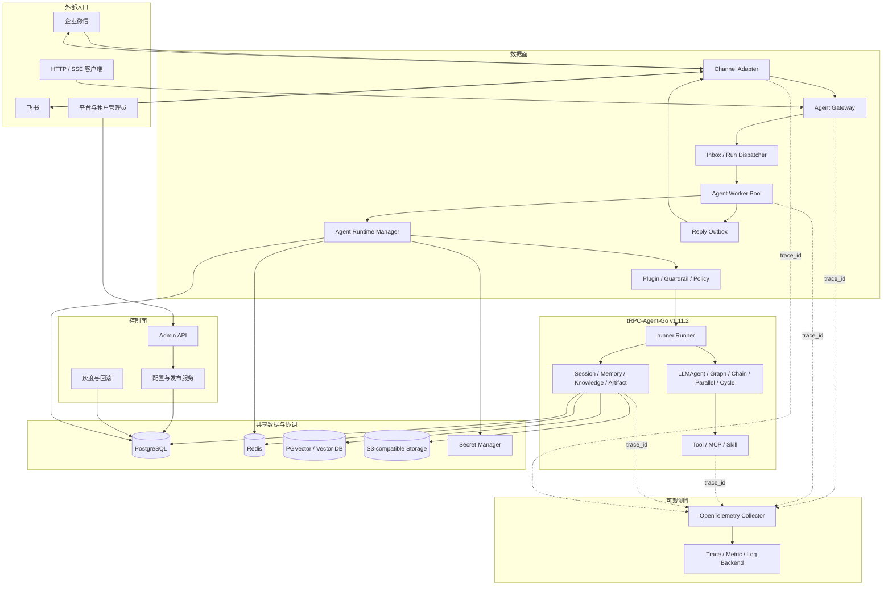

# 总体架构设计

> 本文描述参赛实现的目标架构和组件边界。它是 8 月 27 日方案文档的详细支撑材料，原始验收要求以仓库根目录 README 为准。

## 1. 设计结论

本项目采用“逻辑分层、渐进拆分”的方式：

- 逻辑上分为控制面和数据面，避免管理操作与高频 Agent 请求耦合。
- 开发和最小部署阶段使用一个支持多角色启动的 Go 二进制，减少部署和调试成本。
- 生产阶段将 Gateway、Worker、Channel Adapter 和后台任务拆成独立 Deployment，分别扩缩容。
- Agent 以不可变 Revision 发布，在 Worker 中组装为 `agent.Agent + runner.Runner` 并按需缓存；灰度期间 Session 默认固定 Revision，避免同一对话行为漂移。
- 每次请求创建独立 Invocation；Session、Memory、配置、幂等和审计数据全部外置。
- Worker 不依赖 sticky session。任意健康 Worker 都能从共享后端恢复并继续一个已持久化会话。
- 平台扩展 tRPC-Agent-Go 的租户路由、运行协调和治理能力，不复制 Runner、Agent 或各类存储后端实现。

## 2. 系统架构图



图中的组件是职责边界，不代表第一版必须使用同等数量的进程。最小部署可以在一个进程内装配这些组件，并通过接口保留拆分能力。

## 3. 组件职责

| 组件 | 核心职责 | 不负责 |
| --- | --- | --- |
| Admin API | Tenant、Agent App、Revision、Channel Binding、Backend Profile、Policy 的管理接口 | 直接运行 Agent |
| 配置与发布服务 | 校验配置、生成不可变 Revision、切换流量、回滚 | 保存明文密钥 |
| Channel Adapter | 平台验签、消息解析、媒体下载、回复格式与平台限流适配 | 选择 Agent、执行 Prompt |
| Agent Gateway | 鉴权、租户解析、路由、限流、幂等入口、生成 `request_id` 和 `trace_id` | 持有会话内容、调用具体 Tool |
| Inbox / Dispatcher | 持久化待处理消息、重试、分配 Worker、保证异步 IM 回调不丢失 | Agent 推理 |
| Agent Worker | 取得 Session 运行权、调用 Runner、消费 Event、处理超时取消 | 保存租户配置真相 |
| Runtime Manager | 加载 Revision，组装并缓存 Agent/Runner，管理引用计数和安全淘汰 | 保存用户 Session |
| Policy | 用户授权、工具白名单、预算、敏感信息、危险操作审批 | 实现具体业务 Tool |
| Storage Router | 按租户 Backend Profile 构造并缓存上游 Session/Memory/Knowledge/Artifact Service | 把所有数据强行放入同一种后端 |
| Reply Outbox | 持久化回复、按 Channel 限流和重试、保证安全重复发送 | 重新运行 Agent |
| Telemetry | 统一 Trace、Metric、Log、成本和审计关联字段 | 记录密钥和完整敏感正文 |

## 4. 控制面

### 4.1 Agent 发布模型

一个 Agent 使用两个层次表达：

- `Agent App`：稳定的业务身份，例如“订单客服”。Session 始终归属 App，不因版本升级改变。
- `Agent Revision`：不可变运行快照，包括模型、Prompt、Tool/MCP、Skill、Knowledge、Policy 和 Backend Profile 引用。

发布时先校验所有引用，再生成配置摘要 `config_digest`。Revision 一旦发布不可原地修改。灰度只修改 App 的路由规则，例如：

```text
revision-7: 90%
revision-8: 10%
```

路由结果在 Session 第一个 Run 开始时确定，写入 `sessions.pinned_revision_id`，每个 Run 同时记录实际 `revision_id`。同一 Session 默认持续使用该版本，直到会话 epoch 结束；新 Session 按最新路由规则选择。紧急安全回滚可以显式使指定 Revision 的 Session Pin 失效，正常回滚不修改历史 Run。

### 4.2 配置传播

PostgreSQL 是配置真相源。Worker 使用“通知 + 版本检查”更新本地缓存：

1. 发布服务提交新 Revision 和路由规则。
2. 发布配置变更通知；通知丢失不影响正确性。
3. Worker 收到通知后使对应缓存项失效。
4. 每次缓存命中仍比较路由版本或短 TTL，避免永久使用旧配置。

密钥字段只保存 `secret_ref`。Runtime Manager 在组装 Agent 时通过 Secret Resolver 读取，日志中只记录引用标识。

## 5. 数据面

### 5.1 统一入站消息

Channel Adapter 把不同平台消息转换为统一 `InboundEnvelope`：

```go
type InboundEnvelope struct {
    RequestID       string
    TraceID         string
    TraceParent     string
    ChannelType     string
    ChannelBinding string
    ExternalEvent  string
    SenderID        string
    ConversationID string
    ThreadID        string
    Message         model.Message
    ReceivedAt      time.Time
}
```

外部标识只用于匹配绑定和身份映射。进入核心链路后使用平台内部 ID，避免把手机号、群名等信息写入缓存键和指标标签。

异步链路使用 PostgreSQL Inbox 保存幂等事实和处理状态，使用 Redis Streams Consumer Group 进行低延迟投递与故障认领。Stream 消息只保存 `inbox_id`、路由提示和 W3C `traceparent`；Worker 仍需回查 Inbox，不能把 Stream 当作唯一数据真相。

### 5.2 确定性路由

路由不交给 LLM 判断，而是按以下顺序确定：

```text
channel_type + external_account_id
→ channel_binding
→ tenant_id + agent_app_id
→ 发布路由规则
→ agent_revision_id
→ 健康 Worker
```

HTTP 请求从认证凭证和 URL 中解析 Tenant 与 Agent App。任何一步无法唯一解析都拒绝请求，不回退到公共租户或默认 Agent。

### 5.3 Agent 与 Runner 生命周期

Runtime Manager 使用以下缓存键：

```text
(tenant_id, agent_app_id, agent_revision_id)
```

缓存未命中时，同一个键只允许一个 goroutine 组装对象，其他请求等待结果。组装包括 Model、Tool、Knowledge、Policy、Agent 和 Runner。常用 Revision 可以预热，低频 Revision 懒加载。

缓存按空闲 TTL、最大对象数、估算内存和租户配额淘汰。淘汰时先禁止新 Run，等待引用计数归零，再调用 `Runner.Close()`。需要请求级 Prompt、模型或独立沙箱时，使用 tRPC-Agent-Go 的 `AgentFactory` 按 Run 创建 Agent。

### 5.4 Session 命名

tRPC-Agent-Go 的 Session Key 是 `AppName + UserID + SessionID`，平台按以下方式编码租户边界：

```text
AppName   = t/{tenant_id}/a/{agent_app_id}
UserID    = u/{principal_id}                         # 单聊
UserID    = g/{channel_binding_id}/{group_hash}      # 群聊
SessionID = c/{channel_binding_id}/{conversation_hash}[/t/{thread_hash}]
```

`AppName` 不包含 Revision，使升级和回滚后仍可读取同一 Session。需要清空上下文时创建新的 Session epoch，不删除历史数据。群聊使用合成的群身份作为框架 `UserID`，实际发言人记录在 Event 元数据和审计字段中；默认不把个人长期 Memory 注入群聊，避免隐私泄漏。

## 6. 节点部署

### 6.1 最小可运行部署

```text
trpc-service --role=all
├── Admin API / Gateway / Worker / Channel
├── InMemory 或 SQLite
└── 本地文件 Artifact
```

该模式用于开发和演示，不声称具备多节点容灾。

### 6.2 生产推荐部署

```text
Load Balancer
├── Gateway Deployment × N
├── Channel Deployment × N
├── Worker Deployment × N
└── Background Job Deployment × N

共享服务
├── PostgreSQL HA
├── Redis HA
├── PGVector 或独立 Vector DB
├── S3-compatible Object Storage
└── OpenTelemetry Collector
```

Gateway 和 Worker 都保持无状态。运行中的 HTTP/SSE 连接只绑定当前节点；连接断开不丢失已提交的 Event，客户端可以按 `request_id` 查询结果。IM 请求先写 PostgreSQL Inbox，再投递 Redis Stream 并应答平台回调。Worker 故障后由 Consumer Group 认领未确认消息；定时扫描器也会重新投递 Inbox 中超时的非终态任务。

## 7. 并发与故障边界

- 同一 Session 默认串行执行。Run Coordinator 使用 Redis 租约锁，锁值包含随机 owner token 和单调 fencing token，并由 Worker 续约；失去租约立即取消 `context.Context`。Session 装饰器在写入前拒绝落后的 fencing token，避免暂停后的旧 Worker 回写。
- 不同 Session 可并行执行。同一租户和 Agent 还受并发数、token 和费用配额约束。
- Runner 返回的 Event Channel 必须由唯一消费者持续读取，直到关闭或完成取消后的排空，防止 goroutine 泄漏。
- 入站消息、Run 和出站回复都有稳定幂等键。模型推理可以重试，具有副作用的 Tool 必须接收业务幂等键。
- PostgreSQL/Redis 短暂不可用时停止接收新的有状态 Run；不把生产请求静默降级到 InMemory。
- Worker 退出时先停止领取新任务，取消或等待活动 Run，在宽限期内排空 Event 和写入最终状态。

Runner Event Channel 始终由一个消费者负责。客户端断开只触发取消，不让消费函数提前返回：

```go
runCtx, cancel := context.WithCancel(ctx)
defer cancel()

events, err := r.Run(runCtx, userID, sessionID, message)
if err != nil {
    return err
}

go func() {
    <-clientDisconnected
    cancel()
}()

for evt := range events { // 取消后仍持续读取，直到 Runner 关闭通道
    if err := persistAndForward(runCtx, evt); err != nil {
        cancel()
    }
}
return runCtx.Err()
```

生产代码还需要关闭 `clientDisconnected` 的所有权约定、进程退出宽限期，并使用竞态和 goroutine 泄漏测试验证。

## 8. 实现边界

初期不采用服务网格、自研工作流引擎、跨地域多活、通用事件总线或复杂插件市场。它们不会直接提高本题验收覆盖率，却会显著增加三周内的实现风险。组件间先使用 Go 接口和明确数据契约，确认存在独立扩缩容需求后再拆进程。
