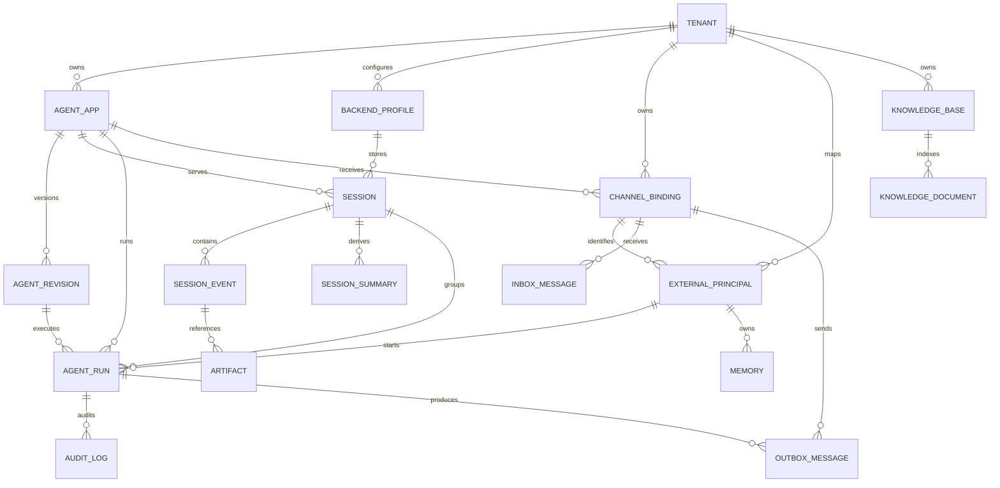

# 数据模型设计

## 1. 建模原则

- `tenant_id` 是所有平台数据的强制分区键。任何查询都不能只依赖资源 ID 而省略租户条件。
- 外部 IM 标识先映射为平台内部 ID，避免 PII 进入主键、缓存键、指标标签和对象路径。
- Agent App 是稳定身份，Agent Revision 是不可变运行快照；Session 归属 App，Run 记录实际 Revision。
- Session Event 是事实记录，Summary、Memory、成本统计和检索索引都是可重建的派生数据。
- 配置表保存 `secret_ref`，不保存模型 API Key、IM Secret 和数据库密码的明文。
- 模型描述的是逻辑实体。Session、Memory 等实际表结构可由 tRPC-Agent-Go 后端维护，平台通过租户装饰器和目录表保持一致语义。

## 2. 实体关系图



## 3. 核心实体

### 3.1 Tenant

| 字段 | 类型 | 说明 |
| --- | --- | --- |
| `id` | UUID/ULID | 不可变租户 ID |
| `slug` | string | 人类可读且唯一的租户短名 |
| `name` | string | 展示名称 |
| `status` | enum | `active/suspended/deleting` |
| `quota` | JSON | 并发、token、费用、存储配额 |
| `audit_policy` | JSON | 正文保留、脱敏、审计周期 |
| `created_at/updated_at` | timestamp | 管理时间 |

暂停租户时拒绝新 Run，但不删除数据。删除采用异步状态机，先停止入口，再按保留策略清理各后端。

### 3.2 Agent App 与 Revision

`agent_apps` 保存稳定身份和当前路由版本；`agent_revisions` 保存不可变配置：

| 字段 | 说明 |
| --- | --- |
| `agent_apps.id/tenant_id/name` | App 的稳定身份 |
| `agent_apps.routing_version` | 每次发布、灰度或回滚递增 |
| `agent_apps.routing_policy` | Revision 权重、白名单和默认版本 |
| `agent_revisions.id/app_id/revision_no` | 不可变版本标识 |
| `agent_revisions.config` | Prompt、模型参数、Tool/MCP、Skill、Knowledge、Guardrail 引用 |
| `agent_revisions.config_digest` | 规范化配置摘要，用于校验与缓存 |
| `agent_revisions.status` | `draft/validated/published/retired` |
| `agent_revisions.created_by/created_at` | 审计信息 |

Revision 不包含密钥值，只引用 Secret 和 Backend Profile。每个 Run 固定记录 `revision_id`。同一个 Session 默认沿用 `pinned_revision_id`；只有创建新 Session epoch、显式解除 Pin 或紧急安全回滚使 Pin 失效后，后续 Run 才重新选择 Revision。

### 3.3 Channel Binding 与身份映射

`channel_bindings` 表示一个外部 IM 账号绑定到一个租户 Agent：

| 字段 | 说明 |
| --- | --- |
| `id/tenant_id/agent_app_id` | 所属租户和目标 App |
| `channel_type` | `wecom/feishu/http/...` |
| `external_account_id` | 企业应用、公众号或 Bot 标识的哈希/非敏感 ID |
| `verify_secret_ref/crypto_secret_ref` | 验签和解密密钥引用 |
| `config` | 长度限制、回调模式、限速、群聊策略 |
| `status` | `active/disabled` |

`external_principals` 使用唯一键 `(tenant_id, channel_binding_id, principal_type, external_id_hash)`，把外部用户、群或会话映射为内部 `principal_id`。跨通道身份默认不自动合并。

### 3.4 Session、Event 与 Summary

平台为每个 Session 保存目录信息，正文由租户选择的 tRPC-Agent-Go Session Backend 持久化：

| 字段 | 说明 |
| --- | --- |
| `sessions.id/tenant_id/agent_app_id` | 平台 Session 身份 |
| `sessions.scope_type` | `direct/group/group_member` |
| `sessions.framework_app_name` | `t/{tenant_id}/a/{agent_app_id}` |
| `sessions.framework_user_id` | 单聊用户或合成群身份 |
| `sessions.framework_session_id` | Channel Binding + 会话/话题哈希 |
| `sessions.backend_profile_id` | 当前 Session 后端 |
| `sessions.pinned_revision_id` | 灰度期间固定的 Agent Revision；紧急回滚可失效 |
| `sessions.epoch` | `/new` 或空闲切分后的会话世代 |
| `sessions.status` | `active/migrating/archived/deleted` |
| `sessions.last_event_at` | 列表和清理使用，不作为并发正确性依据 |

逻辑上的 `session_events` 至少包含：

| 字段 | 说明 |
| --- | --- |
| `event_id` | 全局唯一事件 ID |
| `tenant_id/session_id` | 强制租户和 Session 归属 |
| `request_id/invocation_id` | Run 与 tRPC-Agent-Go Invocation 关联 |
| `revision_id` | 产生该 Event 的 Agent Revision |
| `sequence_no` | Session 内单调顺序；不支持时由适配层投影 |
| `event_type` | user/model/tool_call/tool_result/state/error 等 |
| `payload` | 上游 Event 序列化结果，按审计策略脱敏或加密 |
| `state_delta` | 与 Event 同步提交的状态变化 |
| `sender_principal_id` | 群聊中的实际发言人 |
| `created_at` | 事件时间 |

`session_summaries` 使用唯一键 `(tenant_id, session_id, filter_key, source_end_sequence, summary_version)`，其中 `source_end_sequence` 表示 Summary 覆盖到哪个 Event，防止旧任务覆盖新结果。

### 3.5 Memory、Knowledge 与 Artifact

- `memories`：记录 `tenant_id`、`agent_app_id`、`subject_type`、`subject_id`、正文/引用、提取来源、版本、向量引用、保留时间和状态。单聊通常以用户为 subject；群聊默认只写群共享 Memory，不读取个人私密 Memory。
- `knowledge_bases`：保存租户、名称、Embedding 配置、Vector Backend、索引版本和状态。
- `knowledge_documents`：保存源文件、内容摘要、解析版本、Embedding 版本、索引状态和 Artifact 引用。向量库只保存 chunk 和向量，源文档仍可用于重建索引。
- `artifacts`：保存租户、对象键、内容类型、大小、摘要、加密/扫描状态、保留时间和访问策略。对象键必须以租户 ID 分区。

### 3.6 Inbox、Run、Outbox 与 Audit

`inbox_messages` 对入站消息建立持久幂等：

```text
UNIQUE (tenant_id, channel_binding_id, external_event_id)
```

`agent_runs` 保存 `request_id`、Session、Revision、状态、开始/结束时间、错误类型、token、费用、Worker 和 `trace_id`。状态只允许按定义的状态机前进：

```text
accepted → queued → running → succeeded
                            ↘ failed / canceled / manual_review
```

`outbox_messages` 使用 `UNIQUE (tenant_id, channel_binding_id, idempotency_key)`，记录目标、消息片段、尝试次数、下次重试时间和投递结果。

`audit_logs` 是追加写记录，至少包含题目要求的全部字段：

| 字段 | 说明 |
| --- | --- |
| `tenant_id` | 租户 |
| `channel` | 消息来源通道 |
| `user_id` | 内部 Principal；外部 ID 仅保存受控哈希 |
| `session_id` | 平台 Session |
| `agent_name/revision_id` | Agent 与版本 |
| `tool_name` | Tool/MCP 名称，可为空 |
| `decision` | allow/deny/approve/redact/limit 等 |
| `latency_ms` | 对应阶段耗时 |
| `error_type` | 稳定错误分类，不写敏感错误正文 |
| `cost` | 本次模型或 Tool 成本 |
| `trace_id/request_id` | 技术与业务关联标识 |
| `metadata` | 脱敏后的附加信息 |
| `created_at` | 发生时间 |

## 4. PostgreSQL 参考约束

下面展示关键约束，而不是替代上游 Session Backend 的完整建表脚本：

```sql
CREATE UNIQUE INDEX uq_agent_revision_no
    ON agent_revisions (tenant_id, agent_app_id, revision_no);

CREATE UNIQUE INDEX uq_channel_external_account
    ON channel_bindings (tenant_id, channel_type, external_account_id);

CREATE UNIQUE INDEX uq_inbox_external_event
    ON inbox_messages (tenant_id, channel_binding_id, external_event_id);

CREATE UNIQUE INDEX uq_outbox_idempotency
    ON outbox_messages (tenant_id, channel_binding_id, idempotency_key);

CREATE UNIQUE INDEX uq_session_framework_key
    ON sessions (
        tenant_id,
        framework_app_name,
        framework_user_id,
        framework_session_id
    );

CREATE INDEX ix_audit_tenant_time
    ON audit_logs (tenant_id, created_at DESC);
```

所有平台 Repository 方法都接收显式 `TenantContext`。PostgreSQL 参考实现额外启用 Row-Level Security 作为纵深防御，但应用层仍必须带租户条件，不能把 RLS 当作唯一隔离措施。

## 5. 群聊策略

Channel Binding 明确配置以下一种模式：

| 模式 | Session 范围 | 适用场景 |
| --- | --- | --- |
| `group` | 整个群/话题共享 Session | 群助手，需要理解群内连续讨论 |
| `group_member` | 群内每个成员独立 Session | 涉及个人数据、权限和私密 Memory 的助手 |

无论哪种模式，Tool 授权都使用实际 `sender_principal_id`，不能因为 Session 使用合成群身份而跳过个人权限校验。不同 Tenant、Channel Binding、Group 和 Topic 始终生成不同键。

## 6. 数据生命周期

- 配置与 Revision：Revision 长期保留；删除 App 时先下线，按审计策略延迟清理。
- Session/Event：按租户策略设置 TTL 或归档；读取不延长 TTL，写入才更新活跃时间。
- Summary/索引：派生数据，可重建；源 Event/Document 未到保留期前不先删除。
- Memory：支持用户删除和租户保留策略，删除需同步清理正文与向量引用。
- Artifact：对象存储生命周期规则与平台元数据一致，后台任务处理孤儿对象。
- Audit：使用独立保留周期和只追加权限，业务管理员不能修改历史记录。
