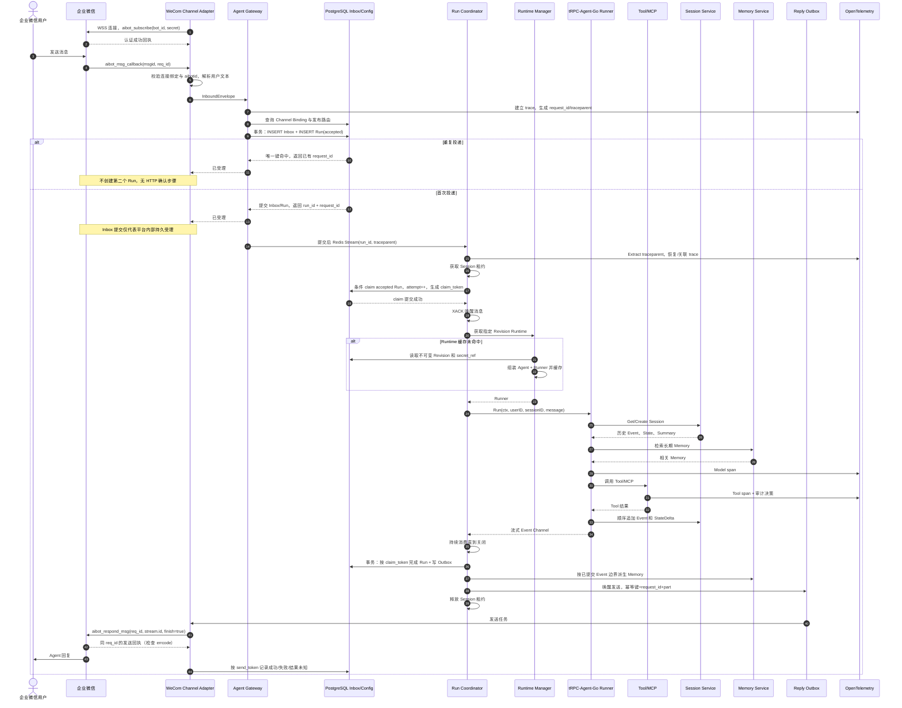
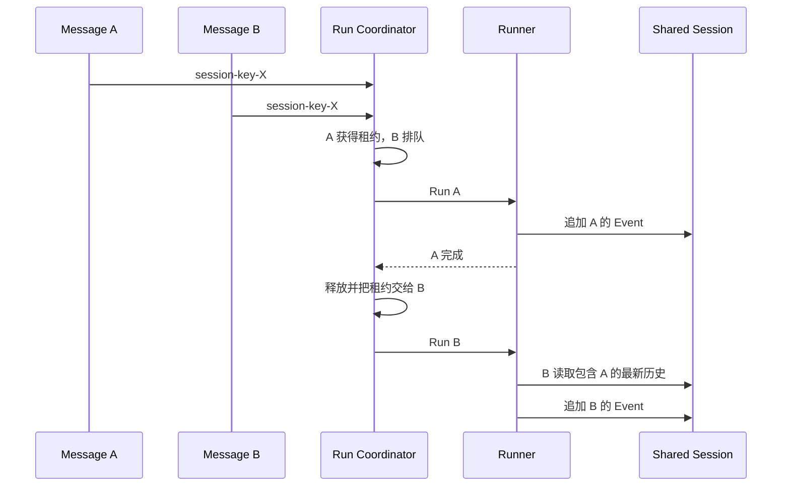

# 核心消息时序

## 1. 企业微信完整链路

以下是目标架构的智能机器人长连接时序；当前代码未接入真实 IM、Memory 或完整 OTel。Webhook 方案需要按其协议在持久受理后返回 HTTP 确认，不能把这一步套到长连接。

`trace_id` 从 Gateway 创建后写入 Context，并传递给 Runner、Model、Tool、Session、Memory 和出站发送 Span。`request_id` 是平台 Run 的稳定业务标识，也作为重试、取消、结果查询和成本聚合的关联键。`msgid` 是企微事件去重标识，企微 `req_id` 只用于平台协议回复关联；二者均不能替代本平台生成的 `request_id`。Outbox 持久化 `traceparent`，发送进程恢复关联 Span；这些完整 Trace 传播属于设计，当前 HTTP 已实现的是 `X-Request-ID` 及 Event 的关联。

## 2. 关键顺序规则

一次 Run 内按以下顺序处理：

1. 长连接认证且机器人账号匹配后才解析租户和身份；Webhook 模式先验签解密。
2. Inbox 提交后才启动 Run。长连接不虚构入站 ACK 或断线回放保证；Webhook 仅在持久受理后返回成功确认。
3. 获取 Session 租约后，先以 PostgreSQL 条件更新 claim Run；claim 提交成功后才确认 Redis 唤醒并加载 Runtime。
4. Runner 顺序持久化用户输入、模型输出、Tool 调用和 Tool 结果 Event。
5. StateDelta 与对应 Event 由具体 Session Backend 在同一原子操作中处理；平台不拆开写入。
6. Run 完成后，以当前 `claim_token` 做 CAS，在一个 PostgreSQL 事务内写入终态和 Outbox；迟到的旧 attempt 无权覆盖。
7. 以已提交 Event 的边界触发 Summary 和 Memory 更新。
8. 回复先进入 Outbox，再调用 IM API；网络错误只重试 Outbox，不重新运行 Agent。

Summary 是派生数据，必须记录输入 Event 边界。旧 Summary 生成任务晚到时，如果其边界小于当前版本，只保存历史版本或丢弃，不能覆盖更新的 Summary。

## 3. 同一 Session 同时收到两条消息

HTTP 调用方可以选择等待或收到 `409 session_busy`；IM 场景默认按到达时间排队。队列必须有最大长度和等待超时，超过限制时返回明确的繁忙提示。

> **当前实现只到"获得租约/被拒绝"这一步。** 上图里的队列尚未实现：拿不到租约的请求直接收到 `409 session_busy` + `Retry-After`，不排队、不继承租约。租约本身也只在 Run 入口互斥，不阻止已经在写的旧 Worker——见 [Session Run Lease](session-lease.md)。

## 4. Worker 故障与重试

Worker 可能在三个阶段故障：

| 故障点 | 恢复方式 |
| --- | --- |
| PostgreSQL claim 前 | Redis PEL 认领未确认唤醒；扫描器也会重新投递长期 `accepted` 的 Run |
| claim 后、Runner 调用前 | Run deadline 扫描器把过期 `running` attempt 重置为 `accepted`；旧 `claim_token` 随即失效 |
| Runner 已开始但结果未知 | 先对账 Session Event；仅当 Revision 无 Tool，或全部 Tool 明确声明可重放且具备跨 attempt 的业务幂等时，才允许自动续跑 |
| Tool 结果未知且不满足重放条件 | Run 以 `tool_outcome_unknown` 失败并进入人工/显式错误处理；不能仅凭 Session 中还只有用户 Event 判断可重跑 |
| Session 已有最终结果、Run/Outbox 未提交 | 从已持久化结果对账并生成 Outbox，不重跑 Agent；终态仍须通过当前 `claim_token` CAS 提交 |
| 回复请求超时、结果未知 | 仅在平台支持时查询状态或使用幂等接口；企微回复引用跨连接有效性未核实，不默认重试成功。目标失效时记录失败，不能改为重跑 Agent |

Redis PEL 只覆盖“Worker 尚未成功 claim PostgreSQL Run”的唤醒窗口。一旦 Run 已经进入 `running`，恢复权归 PostgreSQL deadline 扫描器；扫描器还必须按 `last_dispatched_at` 周期重投长期停留在 `accepted` 的 Run，不能只处理从未投递过的行。

## 5. HTTP 流式链路差异

HTTP/SSE 不需要 Channel Outbox 才能逐片返回：Worker Event 可以由 Gateway 实时转发给客户端，同时把稳定 Event 写入 Session。客户端断开时由策略决定取消 Run或转为后台运行；无论哪种方式，都必须取消无主 goroutine，并允许客户端使用 `request_id` 查询最终状态。
