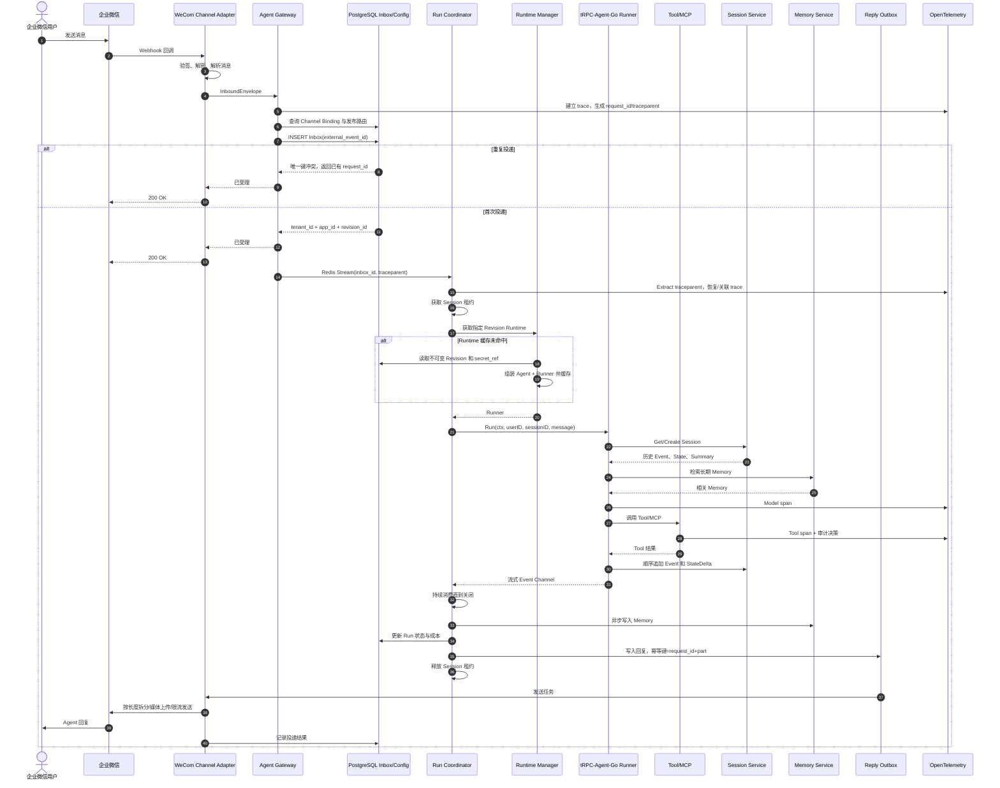
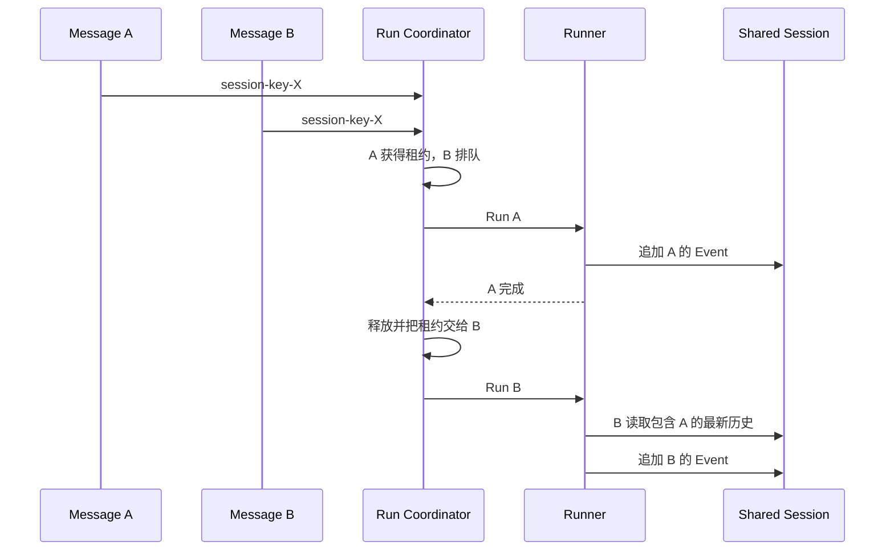

# 核心消息时序

## 1. 企业微信完整链路

`trace_id` 从 Gateway 创建后写入 Context，并传递给 Runner、Model、Tool、Session、Memory 和出站发送 Span。`request_id` 是平台 Run 的稳定业务标识，也作为重试、取消、结果查询和成本聚合的关联键。

## 2. 关键顺序规则

一次 Run 内按以下顺序处理：

1. 验签成功后才解析租户和身份。
2. Inbox 首次写入成功后才向 IM 平台确认已受理。
3. 获取 Session 租约后才加载 Session 和调用 Runner。
4. Runner 顺序持久化用户输入、模型输出、Tool 调用和 Tool 结果 Event。
5. StateDelta 与对应 Event 由具体 Session Backend 在同一原子操作中处理；平台不拆开写入。
6. Run 完成后，以已提交 Event 的边界触发 Summary 和 Memory 更新。
7. 回复先进入 Outbox，再调用 IM API；网络错误只重试 Outbox，不重新运行 Agent。

Summary 是派生数据，必须记录输入 Event 边界。旧 Summary 生成任务晚到时，如果其边界小于当前版本，只保存历史版本或丢弃，不能覆盖更新的 Summary。

## 3. 同一 Session 同时收到两条消息

HTTP 调用方可以选择等待或收到 `409 session_busy`；IM 场景默认按到达时间排队。队列必须有最大长度和等待超时，超过限制时返回明确的繁忙提示。

> **当前实现只到"获得租约/被拒绝"这一步。** 上图里的队列尚未实现：拿不到租约的请求直接收到 `409 session_busy` + `Retry-After`，不排队、不继承租约。租约本身也只在 Run 入口互斥，不阻止已经在写的旧 Worker——见 [Session Run Lease](session-lease.md)。

## 4. Worker 故障与重试

Worker 可能在三个阶段故障：

| 故障点 | 恢复方式 |
| --- | --- |
| Runner 调用前 | 任务仍在 Inbox，其他 Worker 重新领取 |
| Runner 运行中、尚无外部副作用 | 租约过期后重跑，同一 Inbox 记录保持相同 `request_id` |
| Tool 已产生副作用 | Tool 使用 `request_id + tool_call_id` 幂等；无法幂等的 Tool 标记为 `manual_review`，不自动重放 |
| Session 已写入、回复未发送 | 不重跑 Agent，只从已持久化结果重新生成或重试 Outbox |
| 回复请求超时、结果未知 | 先按平台能力查询投递状态；无法查询时以稳定客户端消息 ID 重试并记录可能重复风险 |

## 5. HTTP 流式链路差异

HTTP/SSE 不需要 Channel Outbox 才能逐片返回：Worker Event 可以由 Gateway 实时转发给客户端，同时把稳定 Event 写入 Session。客户端断开时由策略决定取消 Run或转为后台运行；无论哪种方式，都必须取消无主 goroutine，并允许客户端使用 `request_id` 查询最终状态。
