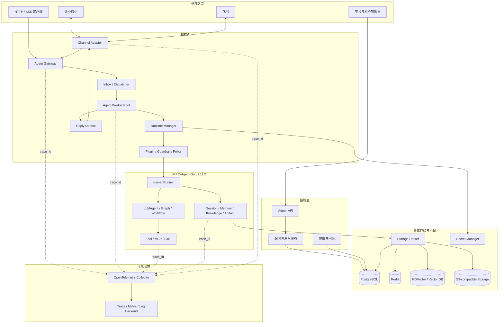
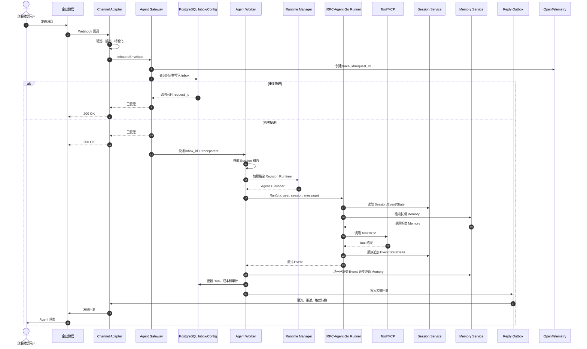

# 基于 tRPC-Agent-Go 的多租户节点化 Agent 平台方案

> 方案版本：1.0

> 方案提交：2026-08-27

> 项目仓库：<https://github.com/d2bz/trpc-agent-service>

## 1. 项目背景与目标

企业通常会为客服、研发、运营等业务建设多个 Agent。如果每个 Agent 都独立实现 IM 接入、Session、Memory、知识库、工具权限、密钥、监控和部署，不仅会重复建设，也难以统一解决跨节点会话、租户隔离、成本控制和合规审计问题。

本项目基于 tRPC-Agent-Go `v1.11.2` 建设统一的多租户 Agent 运行平台。业务 Agent 只关注 Prompt、工作流、Tool、Skill 和 Knowledge；平台统一负责租户识别、Agent 发布与路由、共享状态、多后端适配、IM 接入、安全治理、可观测性和故障恢复。

它不是重新实现 Agent 框架，也不只是转发请求的普通网关，而是连接“Agent 配置管理”和“Agent 实际运行”的控制面与数据面。最终目标是让多个租户在同一平台创建、发布和隔离运行自己的 Agent，绑定企业微信或飞书，选择不同存储后端，并通过多个无状态 Worker 水平扩展。

## 2. 设计思路

### 2.1 核心原则

1. **复用框架，不重复造轮子**：直接使用 tRPC-Agent-Go 的 Agent、Runner、Session、Memory、Knowledge、Tool、Plugin 和服务协议能力。
2. **控制面与数据面分离**：低频配置发布不与高频 Agent 请求耦合。
3. **Agent 配置版本不可变**：发布后生成 Agent Revision，灰度和回滚只调整路由，不原地修改历史版本。
4. **运行对象懒加载、会话状态外置**：Worker 缓存 Agent 与 Runner；Session、Memory、配置、幂等和审计写入共享后端。
5. **不依赖 sticky session**：任意健康 Worker 都能恢复并继续已持久化会话。
6. **先模块化单体，再按角色拆分**：开发阶段降低部署和调试成本，生产阶段再独立扩缩 Gateway、Worker 和 Channel。

### 2.2 tRPC-Agent-Go 复用边界

| 平台需求 | 直接复用 tRPC-Agent-Go | 平台新增能力 |
| --- | --- | --- |
| Agent 编排 | LLMAgent、Graph、Chain、Parallel、Cycle | 租户级 Agent 注册、Revision、发布和路由 |
| 执行入口 | `runner.Runner`、流式 Event、Context 取消 | Worker 调度、并发配额、Run 生命周期 |
| 状态与知识 | Session、Memory、Knowledge、Artifact 及已有后端 | 租户级后端选择、隔离、同步和迁移 |
| Tool 与治理 | Tool、MCP、Skill、Plugin、Guardrail、Callback | 白名单、预算、审批、密钥注入和审计 |
| 服务与 IM | OpenAI-compatible Server、OpenClaw Channel 模型 | Gateway、Admin API、Channel Binding、Inbox/Outbox |
| 可观测性 | OpenTelemetry 基础能力 | 租户维度指标、成本、审计和跨队列 Trace |

### 2.3 当前实现边界

截至方案提交，仓库已经实现真实的 `LLMAgent + Runner + InMemory Session` 最小链路、确定性测试模型、OpenAI-compatible 普通与 SSE 接口、Tenant/App/Revision 内存控制面、Admin API、发布回滚、动态 Runtime 路由、并发单次构建和多租户隔离测试。

当前通过请求头显式选择 Tenant、App 和 Revision，仅用于本地演示。生产版本仍需完成可信身份上下文、PostgreSQL 控制面、服务端 Session Revision Pin、共享 Session、多 Worker、IM Adapter、治理、Telemetry 和生产部署。本文后续章节描述的是最终验收目标，不代表这些能力已经全部实现。

## 3. 总体架构

控制面管理 Tenant、Agent App、不可变 Revision、Channel Binding、Backend Profile、Secret Reference 和 Policy。数据面负责鉴权路由、消息幂等、Worker 调度、Agent 执行、状态读写与回复投递。PostgreSQL 保存配置和业务事实，Redis 负责热状态与协调，向量库保存 Knowledge/Memory 索引，对象存储保存文件和 Artifact。

最小部署使用一个 Go 二进制装配所有模块，加 PostgreSQL、Redis 和 PGVector 运行；生产部署按 `gateway`、`worker`、`channel`、`job` 拆成独立 Kubernetes Deployment，共享数据后端并分别扩缩容。HTTP/SSE 第一阶段与 Worker 同进程；拆分后使用 gRPC Server Streaming 转发 Runner Event，并传递取消信号和 `traceparent`。

## 4. 核心消息链路

`request_id` 是一次业务 Run 的稳定标识，用于幂等、取消、状态查询和成本聚合；`trace_id` 贯穿 IM callback、Gateway、队列、Runner、Model、Tool、Session/Memory 和回复。跨 Redis Streams 或 gRPC 时显式传递 W3C `traceparent`。

## 5. 重点技术设计

### 5.1 多租户隔离与确定性路由

生产请求中的 `tenant_id`、用户和 Channel 身份必须由 API Key、登录凭证或 Channel Binding 推导，不能信任调用方随意填写的 Header。Session Key 使用 `AppName + UserID + SessionID`，平台把 AppName 编码为 `t/{tenant_id}/a/{agent_app_id}`，并在 Redis Key、SQL 复合键、向量元数据和对象路径中重复携带租户作用域。Tool 权限、密钥、预算、日志脱敏和审计也按 Tenant 执行。

路由依次确定 Channel Binding、Tenant、Agent App、Session 和 Revision。Session 第一次运行时由服务端写入 `pinned_revision_id`，后续默认继续使用同一 Revision；新 Session 才参与灰度权重选择，紧急安全回滚可以显式使 Pin 失效。

### 5.2 Agent 生命周期

Agent App 是稳定业务身份，Revision 是模型、Prompt、Tool、Skill、Knowledge、Policy 和 Backend 引用的不可变快照。Worker 按 `(tenant, app, revision)` 懒加载并缓存 `Agent + Runner`，每次请求只创建独立 Invocation。新版本生成新 Runtime，旧版本在活动 Run 结束后按空闲 TTL、LRU 和引用计数安全淘汰。Worker 重启后重新加载 Runtime，并从共享后端恢复会话。

### 5.3 无状态 Worker 与 Session 一致性

平台不使用节点级 sticky session。同一 Session 默认串行运行：Redis 租约保存 owner token 和单调 fencing token，Worker 定期续约，失去租约立即取消 Context；具备 CAS 能力的后端在提交时拒绝过期 token。不同 Session 并行执行，并受租户并发、token 和费用配额限制。

Event 与对应 StateDelta 必须由具体 Session Backend 在 `AppendEvent` 内原子处理。不能实现 CAS/fencing 的上游后端只提供租约保护下的单写者语义，平台会在 Backend Capability 中明确展示，不能宣称网络分区下的线性一致。

### 5.4 数据模型与多后端

最小数据模型如下。除全局生成的资源 ID 外，所有唯一约束和查询都必须包含 `tenant_id`；外键同时校验租户，避免只凭资源 ID 跨租户关联。

| 表/实体 | 关键字段 | 关系与约束 |
| --- | --- | --- |
| `tenants` | `tenant_id`、`name`、`status`、`quota_json`、`audit_policy_json` | `tenant_id` 为主键 |
| `agent_apps` | `tenant_id`、`app_id`、`name`、`default_revision_id`、`routing_version` | `(tenant_id, app_id)` 唯一；一个 Tenant 有多个 App |
| `agent_revisions` | `revision_id`、`tenant_id`、`app_id`、`version`、`config_json`、`config_digest`、`status` | 属于一个 App；发布后配置不可原地修改 |
| `channel_bindings` | `binding_id`、`tenant_id`、`app_id`、`channel_type`、`external_account_id`、`secret_ref` | 外部账号在同一通道内唯一绑定到 Tenant/App |
| `sessions` | `session_pk`、`tenant_id`、`app_id`、`user_id`、`session_id`、`epoch`、`pinned_revision_id`、`backend_profile_id`、`version` | `session_pk` 为内部主键；业务五元组唯一 |
| `session_events` | `event_id`、`tenant_id`、`session_pk`、`sequence_no`、`event_type`、`payload`、`state_delta`、`created_at` | `(tenant_id, session_pk, sequence_no)` 唯一，保证会话内顺序 |
| `memories` | `memory_id`、`tenant_id`、`app_id`、`user_id`、`source_event_id`、`extractor_version`、`content`、`embedding_ref`、`version` | `source_event_id + extractor_version` 幂等 |
| `summaries` | `summary_id`、`tenant_id`、`session_pk`、`from_sequence`、`to_sequence`、`content`、`version` | 记录覆盖的 Event 边界，旧版本不得覆盖新版本 |
| `inbox/runs/outbox` | `request_id`、`tenant_id`、`session_id`、`revision_id`、`status`、`trace_id`、`cost`、`idempotency_key` | 串联入站、运行和回复；状态只能按状态机前进 |
| `audit_logs` | `audit_id`、`tenant_id`、`request_id`、`channel`、`user_id`、`session_id`、`agent_name`、`tool_name`、`decision`、`latency_ms`、`error_type`、`cost`、`trace_id` | 只追加、按保留策略归档，不保存明文密钥 |

| 后端 | 主要数据 | 一致性与取舍 |
| --- | --- | --- |
| PostgreSQL | 配置、Revision、Inbox/Outbox、Run、Audit、冷 Session | 事务强、查询方便，写延迟高于内存 |
| Redis | 热 Session、租约、幂等、限流、Streams | 延迟低，需处理过期、持久化和故障切换 |
| PGVector/向量库 | Knowledge、Memory 向量索引 | 检索高效，索引更新最终一致 |
| S3-compatible | Artifact、图片、文件、知识源 | 成本低，适合大对象，不参与会话事务 |

Summary、Memory 和向量索引是可重建的派生数据，记录来源 Event 边界，旧任务不能覆盖新版本。Memory 提交后发布失效通知，其他 Worker 通过通知加短 TTL 获得最终可见性。Session 从 Redis 迁移到 SQL 时按会话冻结、复制、校验、切换和观察；向量迁移从源文件重建新索引版本后原子切换。

### 5.5 IM 接入与幂等

| 能力 | 企业微信 | 飞书 |
| --- | --- | --- |
| 入站方式 | HTTPS Webhook | 事件订阅 Webhook 或 WebSocket 长连接 |
| 安全 | `msg_signature` 验签、AES 解密 | Verification Token、Encrypt Key、请求签名 |
| 会话标识 | 企业成员/外部联系人、群聊 | Chat、User、Thread |
| 回复限制 | 快速确认，长任务主动回复 | Bot 消息 API，按应用与群维度处理限频 |
| 富消息 | 文本、图片、文件、应用消息 | 文本、富文本、图片、文件、交互卡片 |

两个 Adapter 统一转换为 `InboundEnvelope`，平台差异只保留在验签、身份提取、媒体、限流和回复格式中。Inbox 使用 `(channel_binding_id, external_event_id)` 唯一约束去重；回复先写 Outbox，再调用 IM API，网络重试只重发 Outbox，不能重新运行 Agent。具有副作用的 Tool 使用 `request_id + tool_call_id` 作为业务幂等键。

单聊使用 `direct/{channel_binding_id}/{internal_user_id}` 生成 `session_id`；群聊使用 `group/{channel_binding_id}/{conversation_id}`，支持话题的通道再追加 `/topic/{thread_id}`。同一用户进入不同群会生成不同 Session，跨租户时又由 Tenant 作用域和 Channel Binding 二次隔离；是否把个人长期 Memory 带入群聊由租户策略决定。

回复超过通道长度限制时，Adapter 按语义边界拆分，并使用 `request_id + part_no` 保证分片顺序和幂等；图片、文件先写对象存储或上传通道媒体接口。收到撤回事件时记录对原消息和 Run 的引用，不删除已经提交的审计与 Session Event；若通道支持撤回机器人消息，则通过 Outbox 投递撤回任务，否则按策略忽略或发送更正说明。

### 5.6 治理、安全与可观测性

Runner 的 Plugin、Guardrail 和 Callback 承载租户策略。执行前检查 IM 用户权限、Tool 白名单、预算和敏感输入；危险 Tool 进入人工审批；执行后进行输出脱敏和审计。配置只保存 `secret_ref`，运行时通过 Secret Manager 注入，日志、Trace 和错误响应不得出现明文密钥。

OpenTelemetry Span 覆盖 Channel、Gateway、Run、Model、Tool、Session、Memory 和 Outbox。指标包含每租户请求量、并发 Run、模型/Tool/后端延迟、错误率、IM 投递成功率、token、费用和队列等待时间。审计记录至少包含 `tenant_id`、`channel`、`user_id`、`session_id`、`agent_name`、`tool_name`、`decision`、`latency`、`error_type`、`cost` 和 `trace_id`。

### 5.7 故障恢复

- Worker 故障：Redis Streams Consumer Group 认领未确认消息，PostgreSQL 扫描非终态 Inbox 补偿。
- 模型超时：取消 Context，持续消费并排空 Runner Event Channel，保存终止状态，避免 goroutine 泄漏。
- 数据库故障：有界重试并返回明确错误，不能静默切换到 InMemory。
- Tool 失败：按幂等能力决定重试、降级或人工处理，不能盲目重复副作用。
- Memory/Knowledge 故障：按 Agent 策略降级，并在 Trace 和响应元数据中标识。

## 6. 预期效果与容量目标

1. 至少两个租户可以创建、发布并隔离运行自己的 Agent。
2. 企业微信与飞书完成从消息入站、Agent/Tool 执行到回复的完整演示。
3. 两个 Worker 无需 sticky session 即可继续同一持久化会话，并正确串行处理并发消息。
4. Redis、PostgreSQL、PGVector 和对象存储可以按租户选择，并演示 Session 和索引迁移。
5. 重复 IM 消息只产生一个 Run、一次 Tool 副作用和一组幂等回复。
6. 单次请求可通过 `trace_id` 查询全链路耗时，通过 `request_id` 查询状态、成本和审计。
7. Worker 重启、模型超时、Tool 失败和后端短暂故障均有可测试的恢复行为。

初始容量按平均单轮 15 秒、单 Worker 100 个并发 Run 估算，理论吞吐约 6.7 RPS，按 60% 安全水位取 4 RPS。目标峰值 20 RPS 时需要 5 个 Worker，加 1 个故障冗余共 6 个。若每轮平均写入 6 个 Event，Session Backend 峰值约 120 写 QPS，按两倍突发准备 240 QPS。最终验收使用压测实测 P95/P99、错误率、后端 QPS、token/s 和成本替换估算值。

## 7. 时间规划

| 日期 | 工作与可验证交付物 |
| --- | --- |
| 8/21-8/23 | 冻结题目理解、总体架构、时序、数据模型和一致性方案；跑通最小 Runner 链路 |
| 8/24-8/26 | 完成方案总稿、图表、验收矩阵；完成 Tenant/Revision、Admin API、动态路由和 Runtime 缓存 |
| 8/27 | 提交本方案；演示多租户 Admin → Runtime → Runner → InMemory Session 与 SSE 链路 |
| 8/28-8/31 | PostgreSQL 控制面、可信身份上下文、服务端 Session Pin、共享 Session、双 Worker 连续会话 |
| 9/1-9/4 | Redis 租约与 fencing、多后端路由、Memory/Knowledge/Artifact、Session 和索引迁移 |
| 9/5-9/7 | 企业微信、飞书、媒体、限流、Inbox/Outbox、重复投递和端到端测试 |
| 9/8-9/9 | Guardrail、权限、预算、审计、OpenTelemetry、故障恢复、Compose/Kubernetes |
| 9/10 | 全量回归、竞态与泄漏测试、容量压测、演示脚本和缺陷修复 |
| 9/11 | 按验收矩阵完成正式验收 |
| 9/12-9/14 | 验收后修复、材料整理和最终提交 |

## 8. 主要风险与应对

| 风险 | 缓解措施 |
| --- | --- |
| 同一 Session 被多个 Worker 同时执行 | Redis 租约、fencing token、有界队列、后端 CAS |
| IM 重复或乱序 | Inbox 唯一约束、稳定事件 ID、会话队列、过期消息策略 |
| Tool 重试产生重复副作用 | 业务幂等键；不支持幂等的危险 Tool 转人工 |
| 租户数据串读 | TenantContext、复合查询、键前缀、向量过滤和隔离测试 |
| Worker 崩溃丢失运行中请求 | Inbox 状态机、租约重领、Event/Outbox 持久化 |
| Summary/Memory 旧任务覆盖新数据 | 来源 Event 边界、版本检查和可重建机制 |
| 后端迁移数据遗漏 | 分批游标、数量与校验和、观察期和指针回滚 |
| 模型或 Tool 延迟拖垮节点 | 分级超时、Context 取消、舱壁、断路器和租户配额 |
| 密钥或敏感内容泄漏 | Secret Reference、字段白名单、结构化脱敏和访问审计 |
| IM 平台限流或发送结果未知 | Outbox、指数退避、`retry_after` 和稳定消息 ID |
| Agent Runtime 长期空占资源 | 懒加载、空闲 TTL、LRU、引用计数和租户配额 |
| 工期紧导致范围失控 | 模块化单体、纵向链路优先、逐项测试和验收矩阵跟踪 |

## 9. 交付与验收方式

方案提交以本文作为唯一主文档。最终验收同时提供验收分支代码、自动化测试、最小部署、演示脚本和可复现证据。每项功能只有在设计、代码、测试和演示证据同时具备时才标记完成；已经设计但尚未实现的能力保持计划状态。

本方案的核心价值，是把 tRPC-Agent-Go 已有的 Agent 能力提升为可统一管理、可隔离、可扩展、可观测的企业运行平台，让业务 Agent 保持干净，同时让多租户部署、数据和安全问题由平台集中解决。
